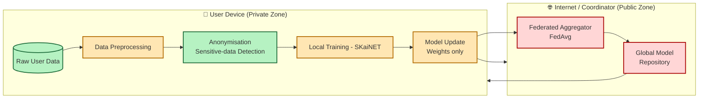
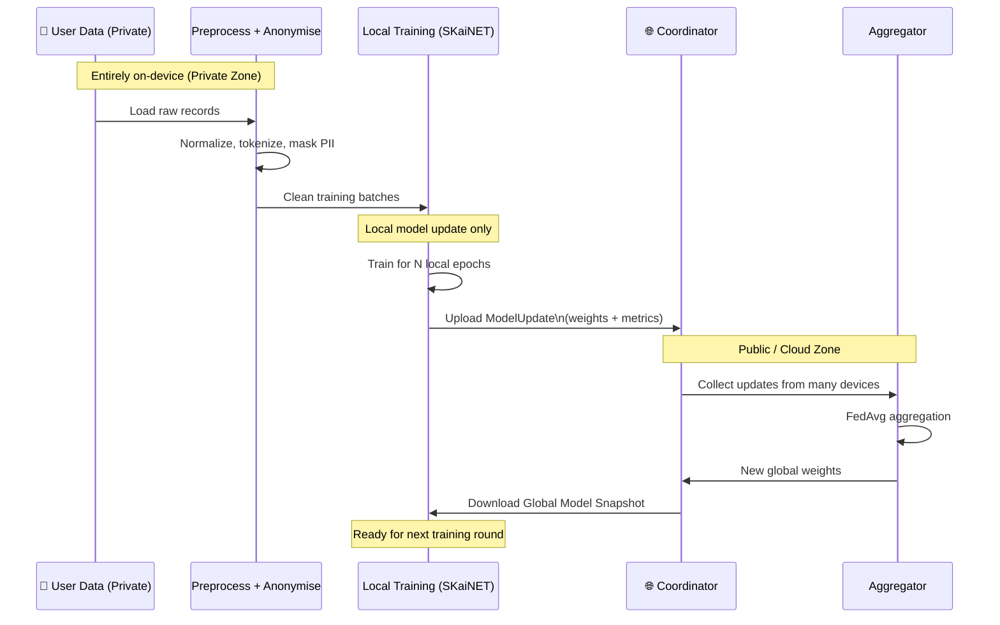

# Federated Learning with SKaiNET (proposal)

> **Status:** design draft / WIP – APIs, module names and artifacts may change.

SKaiNET is a Kotlin Multiplatform deep learning framework designed with a **device-first philosophy** and efficient, portable execution across JVM, Android and other targets. :contentReference[oaicite:0]{index=0}  
This makes it a natural fit for **on-device AI** scenarios where models run close to the data instead of in a central cloud.

Federated learning extends this vision by allowing many devices to **train a shared model collaboratively** while **keeping raw data local and private**.

---

## Why federated learning?

Traditional training:

- Collects user data on a central server
- Trains a model in one place
- Is often not acceptable for privacy-sensitive use cases

Federated learning:

- Runs training **on each device** using SKaiNET’s normal training APIs
- Sends only **model updates (weights/gradients)** to a coordinator
- Aggregates updates (e.g. FedAvg) into a new global model
- Never sends raw user data off-device

This matches SKaiNET’s goals of:

- On-device / edge AI
- Distributed computing and training capabilities :contentReference[oaicite:1]{index=1}  
- Decentralized training with privacy-preserving data handling

---

## High-level architecture

The planned SKaiNET federated learning stack is split into three layers:

1. **Federated Core API (`skainet-federated-core`)**
   - Pure Kotlin Multiplatform
   - Defines common concepts:
     - `FederatedClient`
     - `FederatedCoordinator`
     - `FederatedRound`
     - `ModelUpdate` (weights, optimizer state, metadata)
   - Plugs into existing SKaiNET training/eval helpers and NN DSL. :contentReference[oaicite:2]{index=2}  

2. **Transport / Networking layer (platform-specific)**
   - Separate modules, e.g.:
     - `skainet-federated-transport-ktor` (Ktor client/server)
     - Optional alternative transports (WebSockets, HTTP/JSON, gRPC)
   - Handles:
     - Secure upload/download of model parameters
     - Round coordination messages
     - Device registration and capabilities

3. **Coordinator / Server**
   - JVM-based reference coordinator (e.g. Ktor or Spring Boot)
   - Responsibilities:
     - Tracks global model version
     - Selects a set of available clients per round
     - Aggregates client updates (FedAvg first, more algorithms later)
     - Publishes new global weights

### Architecture

### Dataflow

     
    
### Local on-device training pipeline

To align with SKaiNET’s **device-first** design and the goal of **decentralized training with private data**, each client should implement a local training pipeline that never uploads raw data.

The pipeline has four main stages:

1. **Local data ingestion**
   - Define a `LocalDataSource` that wraps your app’s storage (databases, files, preferences, sensors, etc.).
   - Use `skainet-data` helpers where possible (similar to the MNIST loader and JSON dataset API) to batch data efficiently. :contentReference[oaicite:1]{index=1}  
   - Guarantee that this data source is **only** used on-device; it is never serialized or sent over the network.

2. **Preprocessing & feature construction**
   - Apply deterministic transforms before training:
     - Normalization / standardization
     - Tokenization / vocabulary lookup (for text)
     - Windowing / resampling (for time series or sensor data)
   - Keep this logic in a dedicated module (e.g. `:skainet-local-pipeline`) so model code and preprocessing stay in sync across clients.

3. **Anonymisation & sensitive-data detection**
   - Introduce a small “privacy guard” layer before training:
     - Mark fields as `PII` / `sensitive` in a schema (e.g. names, emails, phone numbers, exact GPS).
     - Run simple detectors (regex, heuristics, basic classifiers) to catch unexpected sensitive content.
   - Strip, mask, or bucket these fields **before** they enter the training dataset, for example:
     - Replace IDs with hash / random IDs
     - Bucket age into ranges (18–24, 25–34, …)
     - Reduce GPS coordinates to coarse regions
   - Log only **aggregated** counts (e.g. “42 records were anonymised”), never raw values.

4. **Local training loop**
   - Use SKaiNET’s existing training API on-device: `train { ctx -> model.forward(x, ctx) }` with your preprocessed batches. :contentReference[oaicite:2]{index=2}  
   - Track local metrics (loss, accuracy, etc.) for each round, but only share:
     - Aggregated metrics (optional)
     - The resulting **model update** (weights / gradients), not the underlying data.

5. **Packaging updates for federated rounds**
   - After local training finishes, convert the updated model parameters into a `ModelUpdate`:
     - Current global model version / round id
     - Client id (pseudonymous)
     - Example count used for training (for weighted aggregation)
   - Serialize via SKaiNET’s I/O layer (e.g. `skainet-io-core` / `skainet-io-gguf`) and send only this update to the coordinator. :contentReference[oaicite:3]{index=3}  

**Summary:**  
Each client builds a small, self-contained training stack:
